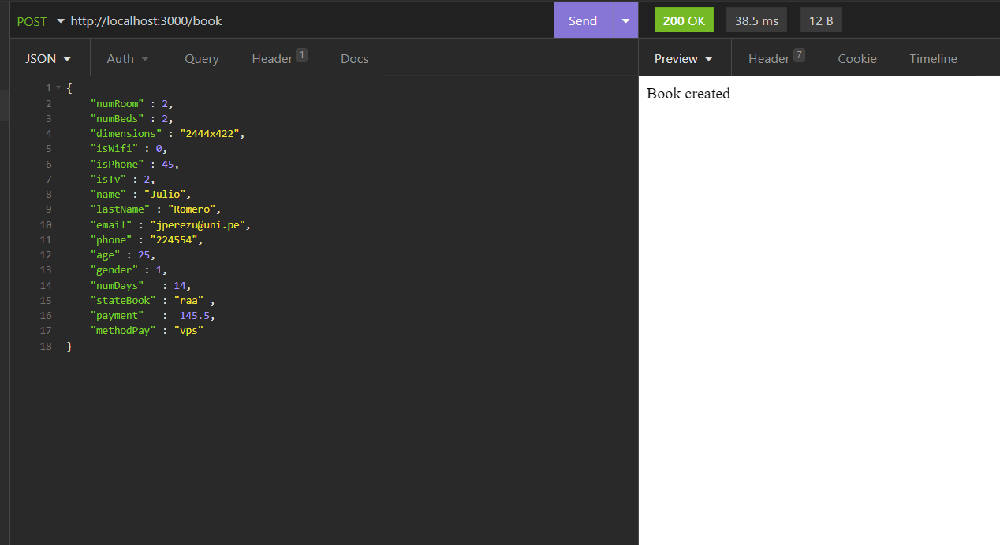

# TuGerente Challenge
To achieve this challenge I consider that we can define following endpoints with their respective methods :
- *'/'*
	**Method GET**: In this route, we can get all information of the database, it is necessary to know all parameters of our clients. 
	
					 											*Picture 1*
	- *'/book'*
	  **Method POST**: In this route we can create a reservation with parameters showed in picture 2.
	  
	  																		*Picture 2*
- *'/book/:idBook'*
   **Method GET**: In this route we can get information of an specific reservation, it is useful to know methods which we can contact with client or the state of the reservation.

   

*Picture 3*
    **Method PUT**: If the client want to change something of his reservation, for example the number of beds or how many days he will be staying, we can change this parameter.

   
   																						*Picture 4*
    **Method DELETE**: Only in case the client has paid and already fulfilled the scheduled days, we can eliminate it from our database.

- */book/:idBook/user/:idUser*
    **Method GET**: We can use this method and route to get personal information of client.

    

    ​																					*Picture 5*

    **Method PUT**: We can use this method and route to update personal information of client.

    

    ​																					*Picture 6.Send new values of the client* 

    

    ​																					*Picture 7.Get personal information updated*

Also I define the database with the above structure:

​																										*Picture 8*

## Instruccions
If you don't want to run docker container and test the project in your computer, you can run the following commands:

- cd /backend

- npm install

- npm run dev

If you want to run docker container of the application:

- docker compose up
# What is the next?

Finish with the interface so that the user can perform the actions mentioned above in a more intuitive way, also, considering the amount of data per reference, you could use a non-relational database like mongoDB and deploy the container in some AWS instance like EC2.

